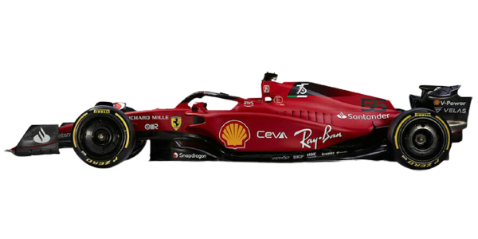

# Amaryllis

# Aufgabenstellung

Im Lernatelier an der BBB hatten wir den Auftrag eine Internetseite mit CSS und html zu erstellen die Webseite sollte technisch möglichst gut sein und spezielle Features enthalten. Wir haben uns entschieden, dass eines der Features ein Auto ist, das sich auf der Webseite als Animation von Links nach Rechtsbewegt. In diesem Eintrag möchten wir euch zeigen, wie wir das Gemacht haben.

# Ziele:

* 1.Der Leser soll verstehen, wie einfache Animation mit html und css funktioniert.
* 2.Der Leser kann in diesem Beitrag das Resultat von so einer Animation sehen.
* 3.Der Leser sieht auf den Code und kann ihn selbst verwenden.
# Inhalt 1

[](https://youtu.be/cd76VYliZr8)

# Inhalt 2
So hier wird erklärt was der Code der Animation genau macht und was die einzelen code zeilen bedeuten. Margin, Width und height haben mit der Animation nichts direkt, diese Codezeilen sind ,da wie gross das Bild der Animation ist und wo die Animation in der Webseite startet. Position : relative ist, da das sich das Bild bewegen kann.animation-name ist, da um der eigentlich Animation au zu führen wie unten sehen wird das Bild mit Animation nur die Animation aus führen die race heisst. animation-duration bedeutet wie lange die Animation dauren soll in diesem fall 5 Sekunden. Das @Keyframes ist hier ,da das die Animation nicht immer sonder nur abgepsilete wird wenn der Name in einer Class stehet. Das From und to beduet das sich das Objekt von -10% sich so lange nach links bewegt bis es 110% erreicht hat. Danach geht es wird zum ursprungsort zurück.

# Inhalt 3

Hier sehen sie wie der Code aussieht im CSS und im HTML
  ```CSS
  .animtation
  {
    margin: 0 0 0 100%;

width: 100px;
height: 100px;
position: relative;
animation-name: race;
animation-duration: 5s;


  }
  @keyframes race {
      from {
        right: -10%;
      }
      to{
          right: 110%;
      }
  }
  ```
  ```HTML
   
  ```
# Reflektion Thema

### Was haben wir gelernt: 
Wir haben gelernt, wie man Animationen in CSS erstellen kann und so seine Website verschönern kann.

### Was waren Schwierigkeiten: 
Mit den Animationen an sich hatten wir keine Probleme, allerdings hatten wir Probleme mit den Animationen beim Responsive Design, denn das Auto, welches wir bewegen wollten, war nicht auf dem Bildschirm sichtbar. Schlussendlich konnten wir aber auch dieses Problem beheben.

### Was ist gut gelaufen: 
Es fiel uns leicht, uns das Thema CSS-Animationen anzueignen, da es auf YouTube sehr viele Tutorials zum Thema Animationen in CSS gibt.

Ein Beispiel zu so einem Video ist folgendes: https://www.youtube.com/watch?v=YszONjKpgg4

### Reflektion Gruppenarbeit

Wir haben in der Gruppe gut zusammengearbeitet und haben uns die verschieden Arbeitspakete aufgeteilt. Schlussendlich konnten wir alle Ziele, bis auf die die aufgrund des JavaScript-Verbot eingeschränkt wurden, erreichen und sind zum gewünschten Ergebnis gekommen.

Für nächstes Mal könnten wir allerdings noch die Synchronisation auf GitHub verbessern. Es kam nämlich häufig dazu, dass neue Ordner im Projekt selber erstellt wurden und das Projekt gar nicht geupdatet wurde.
